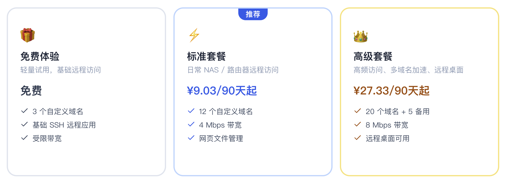
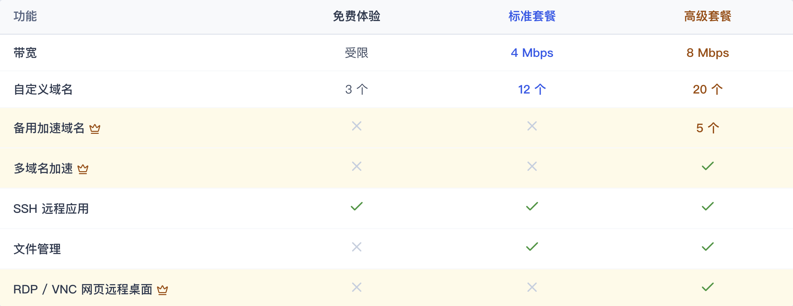

# 套餐问题排查

> 解决套餐购买、绑定、续费等问题

---

## 套餐不显示

### 症状
- 已购买套餐但控制台不显示
- 套餐列表为空

### 可能原因

#### 1. 套餐已过期
过期的套餐不会继续显示在列表中。

**解决：**
- 购买新套餐
- 或在过期前续费

#### 2. 购买了易有云套餐
易有云和 DDNSTO 是两个独立的产品，套餐不通用。

**解决：**
- 确认购买的是 DDNSTO 套餐
- 如买错，联系客服处理

---

## 套餐问题

套餐解绑、绑定、删除设备等操作，可以前往新手学院查看！

- 🟢 [——>新手学院](/zh/guide/ddnsto/scenarios/basics.html) 

---

## 常见问题

### Q: 已购买套餐的设备不小心删除了怎么办？

A: 即使删除了设备，套餐依然还在。重新添加设备后就可以绑定已购买套餐。

### Q: 套餐可以退款吗？

A: 虚拟商品一经售出，原则上不支持退款。如有特殊情况，请联系客服。

### Q: 套餐可以转让吗？

A: 不可以，套餐绑定到账号，不支持转让。

### Q: 免费套餐有什么限制？

A: 免费套餐通常有：
- 带宽限制（如 1Mbps）
- 域名数量限制（如 3 个）
- 功能限制（如不支持远程桌面、文件管理）
- 7 天有效期

---

## 套餐对比

- #### 免费套餐仅限最多2台设备的用户购买。超过2个设备，请购买付费套餐，或将暂时不用的（或离线）设备删除。 

- #### 套餐带宽是理论上限，实际速度受两端网络、运营商线路、服务器节点和设备性能影响。 

---

## 获取帮助

如遇到套餐问题无法解决：

1. 准备好购买凭证（订单号）
2. 记录 Token 前 5 位
3. [联系我们](https://www.linkease.com/about)

## 产品退款的规则说明
- 请发送邮件至 support@linkease.com 进行退款申请，并附带账号及微信付款截图信息，如信息不全将无法退款；
- 仅接受付款14天内的订单，逾期不接受申请；
- 退款申请批准后可能最多需要 7 天的处理时间，退还款项将原支付路径返还。
- 不接受如下退款原因： 不支持 TCP、 无法取消 ip验证。
- 收到邮件后将在 7 个工作日内处理。
